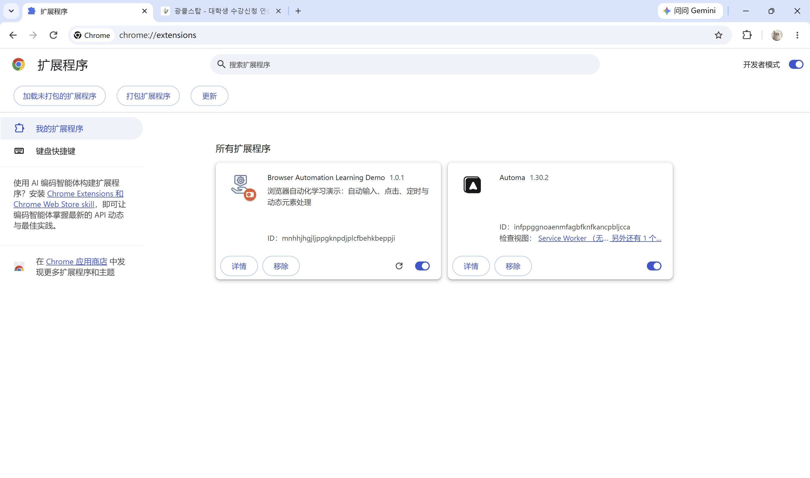
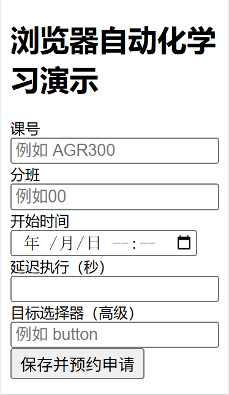
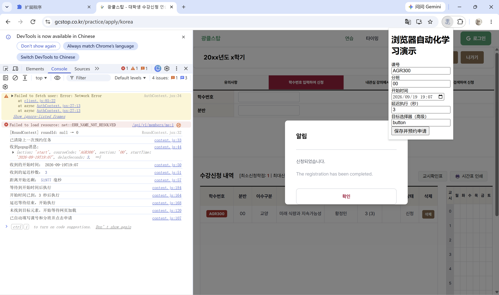
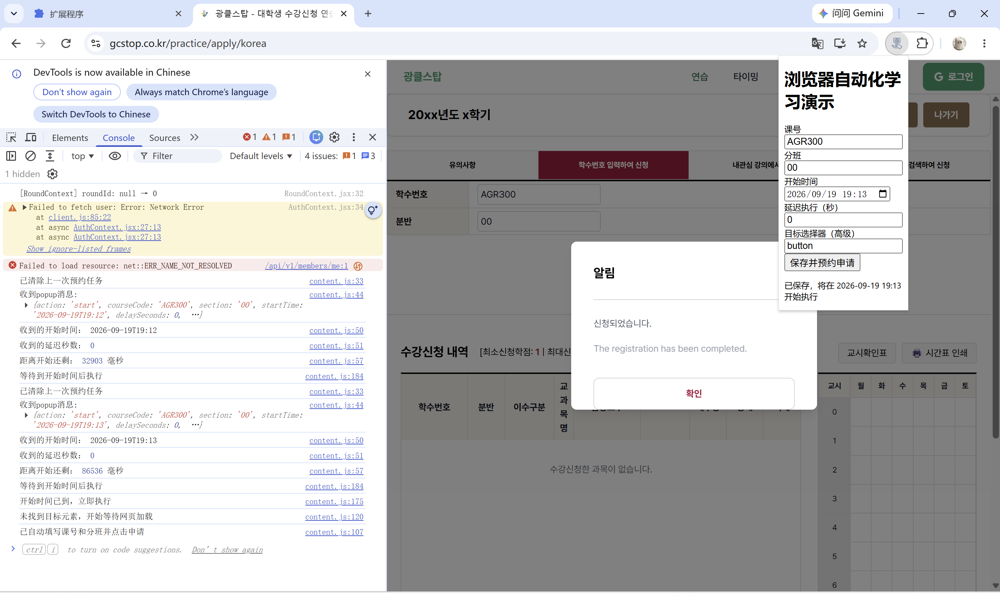
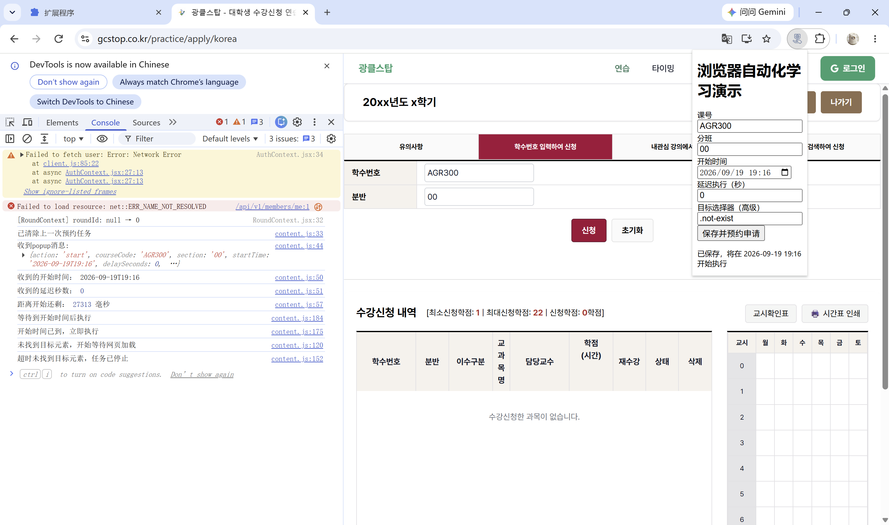

# Browser Automation Learning Demo

浏览器自动化学习演示项目，用于学习 Chrome Manifest V3、Popup 配置、Storage、消息通信、自动输入、定时执行和动态元素处理。

本项目仅在 gcstop 模拟课程申请网页中测试，请勿用于真实教务系统自动提交。

模拟课程申请网站：[https://gcstop.co.kr/practice/apply/korea](https://gcstop.co.kr/practice/apply/korea)

## 功能

- 配置课号、分班、开始时间
- 配置延迟执行秒数
- 保存配置并在下次打开 Popup 时自动回显
- 到指定时间后自动填写并点击申请
- 使用 `input`、`change` 事件让网页框架识别自动输入
- 使用 `MutationObserver` 处理动态加载的网页元素
- 支持高级目标选择器配置
- 空输入、过期时间、无效选择器会显示提示
- 找不到目标元素时，30 秒后自动停止
- 重新预约时自动清除旧任务

## 安装方法

1. 打开 Chrome，访问 `chrome://extensions`
2. 打开右上角“开发者模式”
3. 点击“加载未打包的扩展程序”
4. 选择本项目的 `browser-automation-learning-demo` 文件夹

## 使用方法

1. 打开模拟课程申请网页：[https://gcstop.co.kr/practice/apply/korea](https://gcstop.co.kr/practice/apply/korea)
2. 点击浏览器工具栏中的插件图标
3. 填写课号、分班、开始时间
4. 设置延迟执行秒数；`0` 表示到时间后立即执行
5. “目标选择器（高级）”默认值为 `button`，一般不需要修改
6. 点击“保存并预约申请”
7. 保持目标网页打开，等待插件在指定时间执行

## 测试结果

| 测试项 | 结果 |
| --- | --- |
| 正常定时自动输入与点击 | 通过 |
| 延迟执行 | 通过 |
| 空课号、分班、开始时间提示 | 通过 |
| 开始时间已过提示 | 通过 |
| 无效目标选择器格式提示 | 通过 |
| 找不到目标元素后超时停止 | 通过 |
| 重新预约清除旧任务 | 通过 |
| Storage 配置回显 | 通过 |

## 测试截图

### 1. Chrome 扩展程序加载成功

插件已显示新名称、版本和图标。



### 2. Popup 配置界面

用户可填写课号、分班、开始时间、延迟执行秒数和目标选择器。



### 3. 定时申请成功

Console 显示定时等待、延迟执行、动态元素等待和自动点击流程；模拟网站显示申请成功。



> 注：Console 顶部的 Network Error 来自模拟网站自身的 `/api/v1/members/me` 请求，与本插件无关；下方日志为插件执行日志。

### 4. 重新预约清除旧任务

用户重新预约后，Console 显示“已清除上一次预约任务”，证明旧定时器和旧监听器已停止。



### 5. 找不到目标元素后的超时停止

当目标选择器无法找到元素时，插件等待 30 秒后自动停止，并在 Console 输出提示。



## 已知限制

- 预约后需保持目标网页打开；关闭或刷新网页会取消网页内的定时器
- 当前版本一次只保留一个预约任务；重新预约会覆盖旧任务
- 插件“已自动填写课号和分班并点击申请”不代表网站一定受理成功，最终结果以网页提示为准
- 项目仅用于浏览器自动化学习和模拟网页测试

## 项目结构

```text
browser-automation-learning-demo/
├── manifest.json     插件配置文件
├── popup.html        Popup 页面
├── popup.js          配置读取、Storage 与消息发送
├── content.js        自动输入、定时与动态元素处理
├── icon.png          插件图标
├── screenshots/      测试截图
└── README.md         项目说明
```